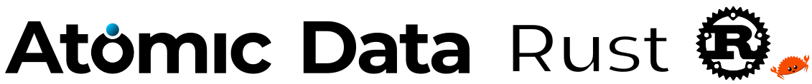

**Create, share, fetch and model [Atomic Data](https://docs.atomicdata.dev)!
AtomicServer is a lightweight, yet powerful CMS / Graph Database.
Demo on [atomicdata.dev](https://atomicdata.dev).
Docs on [docs.atomicdata.dev](https://docs.atomicdata.dev/atomic-data-overview)**

This repo also includes:

- [Atomic Data Browser](/browser/data-browser/README.md), the React front-end for Atomic-Server.
- [`@tomic/lib`](/browser/lib/README.md) JS NPM library.
- [`@tomic/react`](/browser/react/README.md) React NPM library.
- [`@tomic/svelte`](/browser/svelte/README.md) Svelte NPM library.
- [`atomic_lib`](lib/README.md) Rust library.
- [`atomic-cli`](cli/README.md) terminal client.
- [`flutter`](/flutter) a Dart / Flutter client for Atomic Data, plus AtomicCanvas, a collaborative infinite drawing canvas that syncs peer-to-peer between devices.
- [`docs`](docs/README.md) documentation / specification for Atomic Data ([docs.atomicdata.dev](https://docs.atomicdata.dev)).

_Status: alpha. [Breaking changes](CHANGELOG.md) are expected until 1.0._

## AtomicServer

<!-- We re-use this table in various places, such as README.md and in the docs repo. Consider this the source. -->
- 🏠  **Local-first**: create and edit data with no server at all. Resources are addressed by [`did:ad` identifiers](https://docs.atomicdata.dev/did) and resolve peer-to-peer over the Mainline DHT, so an identity is a keypair you hold rather than an account on someone else's machine. Edits are signed CRDT commits that merge when you reconnect.
- 🔒  **Encrypted at rest, per agent**: each agent's in-browser database is encrypted with XChaCha20-Poly1305, under a key wrapped by that agent's own private key. Signing out leaves the cache in place but unreadable to the next session, so no wipe is required.
- 🔑  **Passkey-backed recovery**: a WebAuthn passkey wraps the backup of your agent secret (Argon2id + AES-GCM), so onboarding hands you nothing to write down, and a lost device doesn't have to mean a lost account.
- 🚀  **Fast** (less than 1ms median response time on my laptop), powered by [actix-web](https://github.com/actix/actix-web) and [redb](https://github.com/cberner/redb)
- 🪶  **One self-contained binary** (~70MB): server, web app, full-text search and database in a single file, with no runtime dependencies and nothing to install alongside it.
- 💻  **Runs everywhere** (linux, windows, mac, arm)
- 🔧  **Custom data models**: create your own classes, properties and schemas using the built-in Ontology Editor. All data is verified and the models are sharable using [Atomic Schema](https://docs.atomicdata.dev/schema/intro.html)
- ⚙️  **Restful API**, with [JSON-AD](https://docs.atomicdata.dev/core/json-ad.html) responses.
- 🔎  **Full-text search** with prefix typeahead and 1-edit fuzzy matching, often <3ms responses. Same KV index on the server and in the browser.
- ✨  **AI** with [MCP](https://modelcontextprotocol.io/) support, use any model via OpenRouter or host your own with Ollama.
- 🗄️  **Tables**, with strict schema validation, keyboard support, copy / paste support. Similar to Airtable.
- 📄  **Documents**, collaborative, rich text, similar to Google Docs / Notion.
- 💬  **Group chat**, performant and flexible message channels with attachments, search and replies.
- 📂  **File management**: Upload, download and preview attachments.
- 💾  **Versioning** / history from the Loro oplog, with writes authorized by [Atomic Commits](https://docs.atomicdata.dev/commits/intro.html)
- 🔄  **Real-time synchronization**: instantly communicates state changes with a client. Build dynamic, collaborative apps using [websockets](https://docs.atomicdata.dev/websockets) (using a [single one-liner in react](https://docs.atomicdata.dev/usecases/react) or [svelte](https://docs.atomicdata.dev/svelte)).
- 🧰  **Many serialization options**: to JSON, [JSON-AD](https://docs.atomicdata.dev/core/json-ad.html), and various Linked Data / RDF formats (RDF/XML, N-Triples / Turtle / JSON-LD).
- 📖  **Pagination, sorting and filtering** queries using [Atomic Collections](https://docs.atomicdata.dev/schema/collections.html).
- 🔐  **Authorization** (read / write permissions) and Hierarchical structures powered by [Atomic Hierarchy](https://docs.atomicdata.dev/hierarchy.html)
- 📲  **Invite and sharing system** with [Atomic Invites](https://docs.atomicdata.dev/invitations.html)
- 🌐  **Embedded server** with support for HTTP / HTTPS / HTTP2.0 (TLS) and Built-in LetsEncrypt handshake.
- 📱  **Runs on mobile**: `atomic_lib` compiles into Flutter apps through [flutter_rust_bridge](https://github.com/fzyzcjy/flutter_rust_bridge), so phones get the same local-first store, signing and peer sync as the browser, not a thin REST wrapper. See [`/flutter`](/flutter).
- 📚  **Libraries**: [Javascript / Typescript](https://www.npmjs.com/package/@tomic/lib), [React](https://www.npmjs.com/package/@tomic/react), [Svelte](https://www.npmjs.com/package/@tomic/svelte), [Rust](https://crates.io/crates/atomic-lib), and a [Dart / Flutter client](/flutter/lib/atomic)

https://user-images.githubusercontent.com/2183313/139728539-d69b899f-6f9b-44cb-a1b7-bbab68beac0c.mp4

## Documentation

Check out the [documentation] for installation instructions, API docs, and more.

## Contribute

Issues and PRs are welcome!
And join our [Discord][discord-url]!
[Read more in the Contributors guide.](CONTRIBUTING.md)

## Funding

Atomic Data and AtomicServer have been supported by [NLnet](https://nlnet.nl) through the NGI
Assure, NGI0 Entrust and NGI0 Commons funds, with financial support from the European Commission's
[Next Generation Internet](https://ngi.eu) programme, and through Eurostars. This is a large part
of why the project is MIT licensed and has no proprietary core.
[Details and grant agreement numbers](https://docs.atomicdata.dev/acknowledgements.html).

## Licence and trademarks

The code is [MIT licensed](./LICENSE) — fork it, modify it, sell it.

The Atomic **names and logos** are not covered by that grant; they are
reserved. Trademark is what lets the code stay permissively licensed, so a
fork can do anything except present itself as the official Atomic Server. See
[TRADEMARKS.md](./TRADEMARKS.md) for the policy and [brand/](./brand/) for the
artwork, which is the single source of truth for every icon across all the
Atomic apps.

[documentation]:https://docs.atomicdata.dev/atomicserver/installation

[discord-badge]: https://img.shields.io/discord/723588174747533393.svg?logo=discord
[discord-url]: https://discord.gg/a72Rv2P
