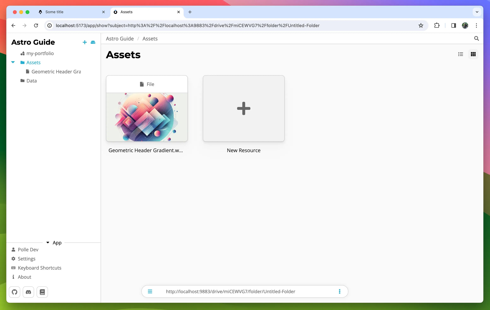
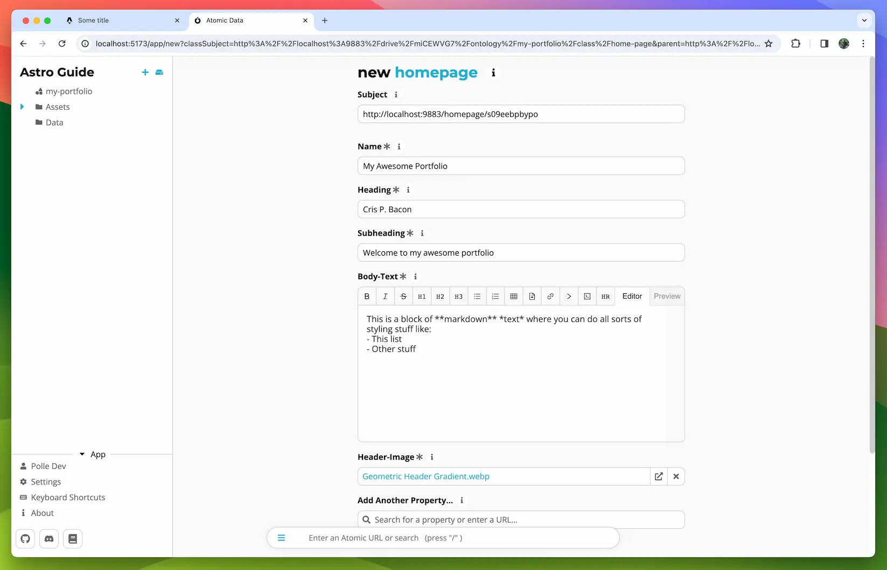

# Creating the homepage data

Lets make two folders, one for our images and one for the data. You can create a folder by clicking on the + button in the top left and choosing 'folder'
Create one called 'Assets' and one called 'Data'

Since we need a header-image to create a homepage resource we should upload one first. You can use any image but you get bonus points if it's a cute image of your cat. To upload go to the 'Assets' folder and drag & drop an image into the folder.

> **TIP:**  
> You can change the folder view mode by clicking on one of the two buttons in the top right.

Now move into the 'Data' folder and click on '+ New Resource'. There should now be a section under the base classes with all classes from your ontology. Click on 'homepage'.

Fill out the form to your liking and hit save at the bottom

