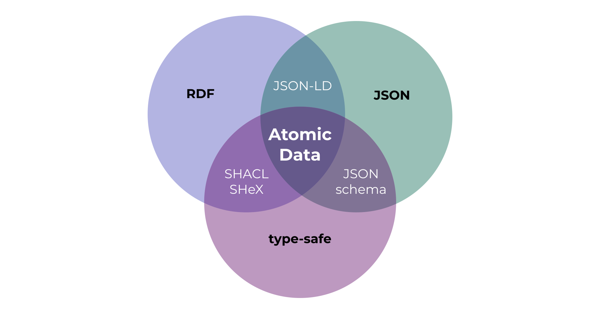

{{#title Atomic Data}}

**Atomic Data is a modular specification for sharing, modifying and modeling graph data. It combines the ease of use of JSON, the connectivity of RDF (linked data) and the reliability of type-safety.**

Atomic Data uses links to connect pieces of data, and therefore makes it easier to connect datasets to each other - even when these datasets exist on separate machines.

Atomic Data has been designed with [the following goals in mind](motivation.md):

- Give people more control over their data
- Make linked data easier to use
- Make it easier for developers to build highly interoperable apps
- Make standardization easier and cheaper

Atomic Data is [Linked Data](https://ontola.io/what-is-linked-data/), as it is a [strict subset of RDF](interoperability/rdf.md).
It is type-safe (you know if something is a `string`, `number`, `date`, `URL`, etc.) and extensible through [Atomic Schema](schema/intro.md), which means that you can re-use or define your own Classes, Properties and Datatypes.

The default serialization format for Atomic Data is [JSON-AD](core/json-ad.md), which is simply JSON where each key is a URL of an Atomic Property.
These Properties are responsible for setting the `datatype` (to ensure type-safety) and setting `shortnames` (which help to keep names short, for example in JSON serialization) and `descriptions` (which provide semantic explanations of what a property should be used for).

[Read more about Atomic Data Core](core/concepts.md)

## Atomic Data Extended

Atomic Data Extended is a set of extra modules (on top of Atomic Data Core) that deal with data that changes over time, authentication, and authorization.

{{#include extended-table.md}}

## Atomizing: how to create, convert and host Atomic Data

Atomic Data has been designed to be very easy to create and host.
In the Atomizing section, we'll show you how you can create Atomic Data in three ways:

- [Using Atomic Server, from your browser](atomicserver/intro.md)
- [By creating JSON-AD (and optionally importing it)](create-json-ad.md)
- [By upgrading your existing application](interoperability/upgrade.md)

## Tools & libraries

- Browser app [atomic-data-browser](https://github.com/atomicdata-dev/atomic-data-browser) ([demo on atomicdata.dev](https://atomicdata.dev))
- Build a react app using [typescript & react libraries](https://github.com/atomicdata-dev/atomic-data-browser). Start with the [react template on codesandbox](https://codesandbox.io/s/atomic-data-react-template-4y9qu?file=/src/MyResource.tsx)
- Host your own [atomic-server](https://github.com/atomicdata-dev/atomic-server) (powers [atomicdata.dev](https://atomicdata.dev), run with `docker run -p 80:80 -v atomic-storage:/atomic-storage joepmeneer/atomic-server`)
- Discover the command line tool: [atomic-cli](https://github.com/atomicdata-dev/atomic-server) (`cargo install atomic-cli`)
- Use the Rust library: [atomic-lib](https://github.com/atomicdata-dev/atomic-server)

## Get involved

Make sure to [join our Discord](https://discord.gg/a72Rv2P) if you'd like to discuss Atomic Data with others.

## Status

Keep in mind that none of the Atomic Data projects has reached a v1, which means that breaking changes can happen.

## Reading these docs

This is written mostly as a book, so reading it in the order of the Table of Contents will probably give you the best experience.
That being said, feel free to jump around - links are often used to refer to earlier discussed concepts.
If you encounter any issues while reading, please leave an [issue on Github](https://github.com/ontola/atomic-data/issues).
Use the arrows on the side / bottom to go to the next page.

{{#include SUMMARY.md}}
